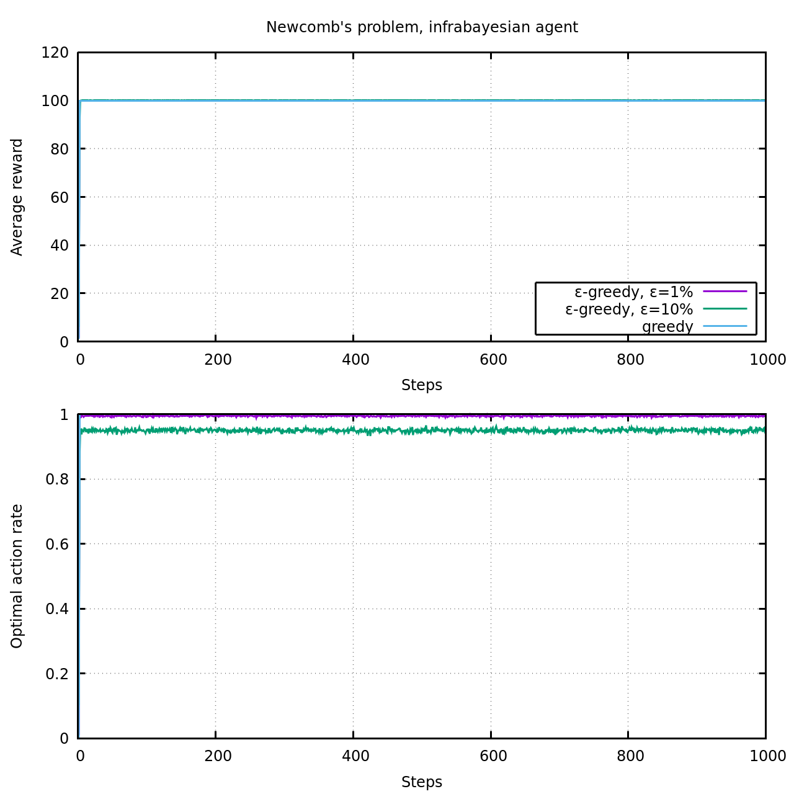

# Infrabayesian Reinforcement Learning Experiment
This is minimal implementation of a reinforcement learning agent using infrabayesianism. It is designed to be the simplest scenario where classical agents fail, but infrabayesian ones succeed.

## Environments
The implementation focuses on multi-armed bandit-like environments, which consist of a single time-step and where no information is available to the agent, prior to making its decision. Restricting to these environments avoids much of the complexity usually associated with this problem.

Three types of environment are currently implemented:
- Classical multi-armed bandit: a fixed number of discrete action are available to the agent. A reward is sampled from a different probability distribution, depending on the action. Distributions are fixed over time. The episode ends after a single interaction.
- Newcomb's problem (with box contents 1 and 100): the agent chooses one of two options. A predictor determines the most likely action that the agent will take. The reward depends on the prediction and the actual action. This makes the environment policy-dependent.
- Policy-dependent bandit: this is a generalisation of both the classical multi-armed bandit and of Newcomb's problem. The agent is presented with a fixed number of discrete actions. A predictor determines its most likely action. The reward is sampled from a different probability distribution for each (prediction,action) pair. The probability distributions are determined randomly.

## Agents
Three types of agent are considered:
- Classical agent: simple agent based on Barto&Sutton[^1] that uses sample averages to estimate the expected reward of each action and then picks that action that maximises the expected reward.
- Bayesian agent: similar to the classical agent, but uses Bayesian inference to update its estimates of the true rewards.
- Infrabayesian agent: maintains reward estimates for all (environment,action) pairs and picks that action that maximises the worst-case reward over all consistent environments.

All agents use an ε-greedy policy to encourage exploration and optionally start with optimistic estimates of rewards.

Different conventions might be chosen for all agent types. Some conventions might lead to qualitatively different results.

## Results
As a check of the implementation, the classical agent is tested on the classical multi-armed bandit problem. The implementation successfully reproduces figure 2.2 from Barto&Sutton[^1] (10 arms, averaged over 2000 runs).

The bayesian and infrabayesian agents behave similarly.

Next, we apply the agents to Newcomb's problem. See, [classical](figures/newcomb.classical.png), [bayesian](figures/newcomb.bayesian.png) and [infrabayesian](figures/newcomb.infrabayesian.png) plots. It is not easy to see on the plots, but the classical agents fail to converge to 1-boxing. They exhibit the following behaviour:
1. They quickly learn the typical rewards: 1-boxing: reward 100; 2-boxing: reward 1. Based on this observation, they pick the 1-box policy.
2. Due to the ε-greedy policy, they will occasionally explore and 2-box. The predictor does not expect this, so they receive reward 101.
3. Every time this happens, the expected reward of 2-boxing slightly increases (asymptotically up to 101) and eventually it surpasses the reward 100 of 1-boxing.
4. When this happens, the agent adopts the 2-boxing policy. In response, the predictor leaves the second box empty, such that the reward drops to 1.
5. Upon observing this, the agent updates the expected reward of 2-boxing downwards and switches back to 1-boxing.
6. Repeat steps 2-5.

While the agents 1-box most of the time, they do not converge to the one-boxing policy. The oscillation described above continues forever.

Let's turn to the infrabayesian agent. This agent is aware that the reward might depend on the specific environment it is placed in (in this context: specific environment = prediction action). It thus maintains rewards for all (prediction,action) pairs. It learns the entire reward table, which is in this case
Raw reward table | Action 1-box | Action 2-box
---------------- | ------------ | ------------
Predict 1-box    |          100 |          101
Predict 2-box    |            0 |            1

From this table, it discards all options that are logically inconsistent (Nirvana trick) and then picks for each action the worst-case reward:
With Nirvana     | Action 1-box | Action 2-box
---------------- | ------------ | ------------
Predict 1-box    |          100 |            ∞
Predict 2-box    |            ∞ |            1
Worst-case       |          100 |            1

In this case it finds that 1-boxing has a higher worst-case reward, so it adopts this policy. Thus, the agent converges to the optimal policy.
Due to the ε-greedy policy, the agent still sometimes 2-boxes. This is not an issue as the actual policy has converged to 1-boxing and does not change from this. In this particular case, it is even helpful, as the predictor cannot expect this, so it still fills the second box and the agent receives reward 101. For ε=10%, the agent achieves an average reward of 100.05.

The policy-dependent bandit environment seems to yield similar results, but should be studied in more detail.

## Observations/Limitations
This implementation assumes that the predictor is perfect. Dealing with imperfect predictors is an important aspect of infrabayesianism and should be included in a future version. Some environments become pathological for infallible predictors. 

The (perfect) predictor should not predict the actual action, but rather the most likely (i.e. greedy) action. If the agent adopts a random policy, the predictor can no longer predict the outcome perfectly. Further, if the predictor could perfectly predict the actual action taken, the policy-dependence of the environment would become irrelevant, was the outcome only depends on the action taken.

ε-greedy exploration is broken for the infrabayesian agent. For a fixed policy, the agent cannot observe the full outcome, even if it picks a random action due to exploration. E.g. if the agent has a 1-boxing policy, it can never observe the rewards that would arise if the predictor predicted 2-boxing. This issue is currently avoided by starting with a high optimism, such that the agent actually changes its policy. This is not a robust solution and it should be addressed in a more general way.

[^1]: *Reinforcement Learning: An Introduction*, Richard S. Sutton and Andrew G. Barto, Second Edition, MIT Press, Cambridge, MA, 2018, [PDF](https://web.stanford.edu/class/psych209/Readings/SuttonBartoIPRLBook2ndEd.pdf)
