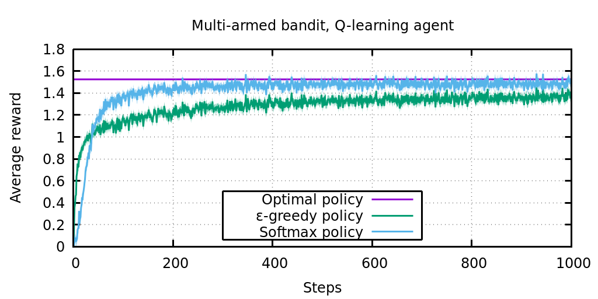
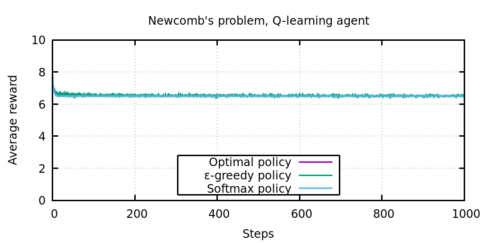
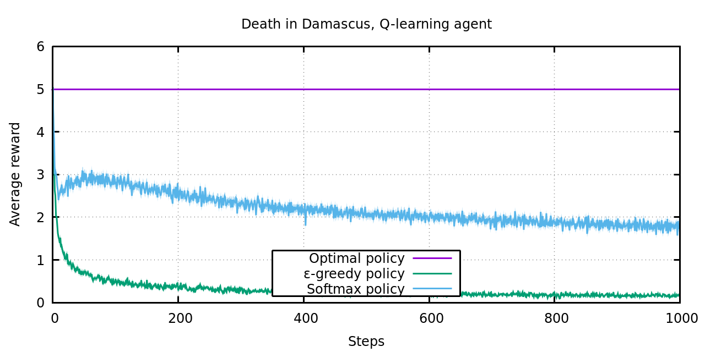

# Infrabayesian Reinforcement Learning Experiment
This aims to be a minimal implementation of a reinforcement learning agent using infrabayesianism. To goal is to find the simplest scenario where classical agents fail, but infrabayesian ones succeed.

## Environments
The implementation focuses on bandit-like environments, i.e. environments consisting of a single time-step and where no information is available to the agent, prior to making its decision. Restricting to these environments avoids much of the complexity usually associated with this problem.

The following environments are currently implemented:[^1]
- Classical multi-armed bandit: A fixed number of discrete action are available to the agent. A reward is sampled from a different probability distribution, depending on the action.
- Newcomb's problem: The agent chooses to take only box B or boxes A and B. Box A is always filled with a small reward. Box B is filled with a large reward, but only if the agent the agent is predicted not to take box A.
- Death in Damascus: The agent chooses to go to either the city of Damascus or Aleppo. Death knows the agent's policy and also goes to one of the cities. If they end up in the same city, the agent dies.

## Agents
Currently, only a classical Q-learning agent is considered.[^2] The agent uses either an epsilon-greedy or a softmax policy (with decaying epsilon/temperature) to encourage exploration.

## Results
For each environment 2000 independent runs are performed. At each time step, the average reward is calculated. The results are given in the figures below.

We find that the classical agent converges close to the optimal policy on the multi-armed bandit environment, but fails to do so the the Newcomb-like environments. Note that the spread of individual runs is quite large. There are runs in which the classical agent achieves close-to-optimal reward on Newcomb-like environments. But even then, it does not converge on the optimal policy and looking at the plots we clearly see that we can not rely on the agent to behave sensibly on average.

## Changelog and lessons learned
### v2
- Remove Bayesian and Infrabayesian agents, as they are probably not doing what we want
- Remove policy-dependent bandit environment; add Death in Damascus environment
- Previously the predictor received the most likely (greedy) action and set up the environment based on that. This is not what we want and it creates incentives for strange policies (e.g. one-box 51% of time, two-box otherwise). A better convention is "policy peeking", where the predictor has access to the entire policy of the agent. Here, policy means the probability distribution from which an action is sampled. Eventually, this should include counterfactual states (branches of the history that did not play out), but for the environments considered here this does not matter. If the agent chooses a non-deterministic policy, the predictor can correspondingly set up a non-deterministic environment (e.g. if the agent's policy is to flip a coin whether to one-box or two-box, the predictor will flip a coin whether to fill the second box)
- The statement above implicitly contains a design choice: we assume that the predictor knows the probability distribution. Alternatively, we could say that the predictor is able to predict even the outcome of the random sampling and thus knows the action. The former choice is probably more interesting. Also, for the environments considered here the second choice would effectively turn them into classical environments (if the predictor knows the exact action, it would not care how the agent got there and the policy dependence disappears. The outcome only depends on the agent's action)
- Policies are explicitly represented as probability distributions, rather than just functions that sample from them (such that the predictor can inspect them)
- Add softmax policy type, in addition to epsilon-greedy

### v1
- Initial release
- Lots of conceptual mistakes

[^1]: *Reinforcement Learning in Newcomblike Environments*, Proceedings to NeurIPS 2021, [PDF](https://proceedings.neurips.cc/paper_files/paper/2021/file/b9ed18a301c9f3d183938c451fa183df-Paper.pdf)

[^2]: *Reinforcement Learning: An Introduction*, Richard S. Sutton and Andrew G. Barto, Second Edition, MIT Press, Cambridge, MA, 2018, [PDF](https://web.stanford.edu/class/psych209/Readings/SuttonBartoIPRLBook2ndEd.pdf)
